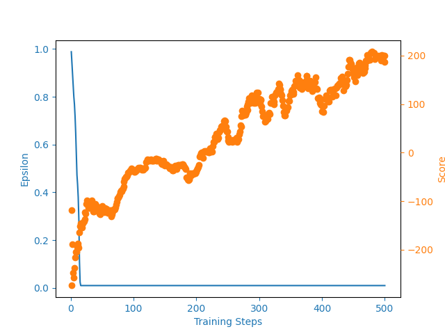
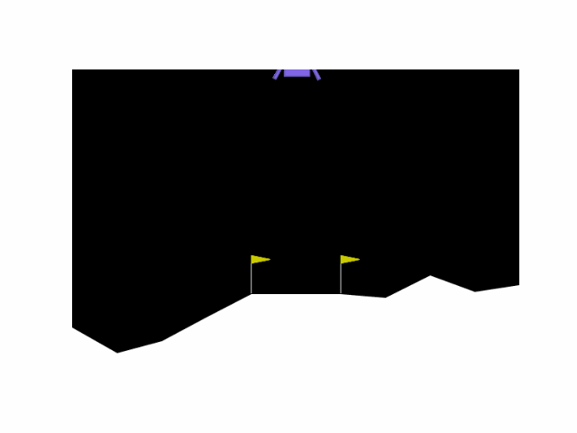
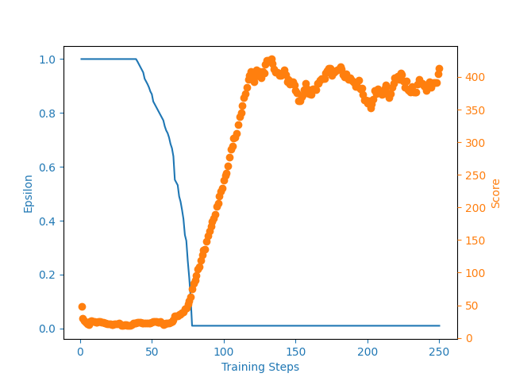
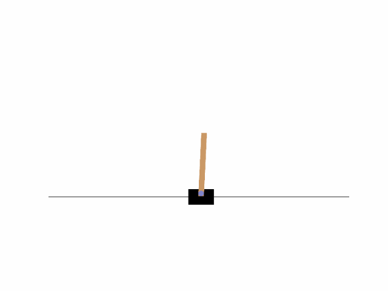
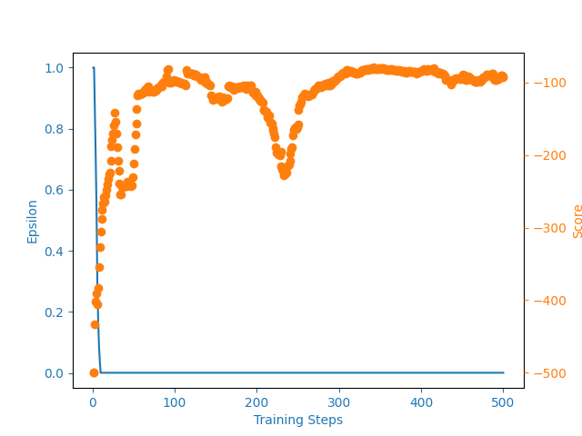
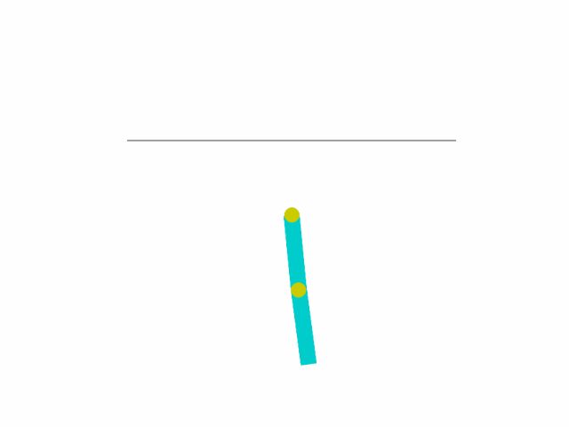

# RL_project
# Final Project of the course "Reinforcement Learning"
### Team members:
- Nikita Bogdanov
- Nikolay Kashin
- Gleb Mazanov

## Topic of the project
Application of Deep Q-Learning to find a solution to environments from GYM

This project explores the Deep Q-Learning approach and its application to an optimization problem using the Python library GYM.

# Overview
## Scripts
The script [create_agent.py](create_agent.py) is designed to create an Agent that will act in the environment. It is based on Deep Q-Learning approach, which allows to teach the agent to choose the most appropriate action depending on the current observation

The script [utils.py](utils.py) is designed to save a training graph, where you can see how the average reward and epsilon hyperparameter changed during training

## Results

We have obtained following results for the corresponding models:
1) Lunar Lander environment

2) Cart Pole environment
   

3) Acrobot environment

